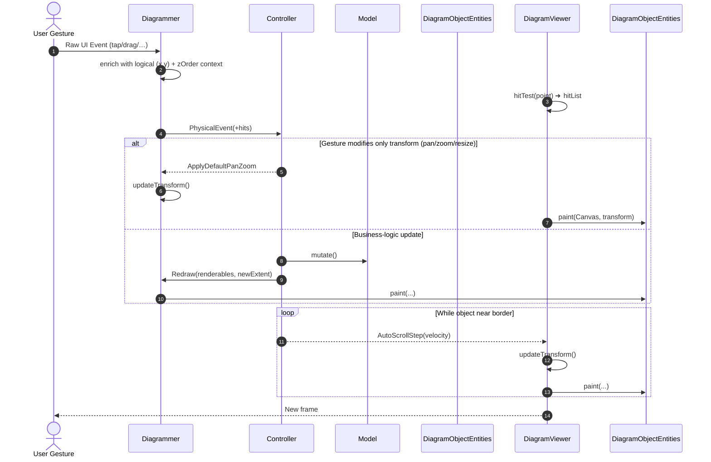

# Diagrammer (DiagramViewer) structure

# Initial Requirements

I have decided that the diagrammer will remain independent from the logic of the diagrams it implements, so I need to design its API to allow for this.

The diagrammer must:

- Manage a two-dimensional (or three-dimensional?) logical vector space and the corresponding physical vector space that will account for zoom and offset related to the scrolling of the diagram itself.
    - This means that the transformation matrix that implements zoom and offset will be an attribute of the diagrammer itself.
- Support Pan and zoom events autonomously (even if controlled by its Controller)
- Maintain a list of objects to be displayed in the diagram through a unified interface, to which it will pass an already scaled and moved Canvas, and each object must know how to draw itself on it.
- The Diagrammer must detect all events that occur in its UI, enrich them with information related to the logical vector space, and pass them to the Controller without performing any other action in response to them.
- The Diagrammer will constantly listen to a stream from the Controller that will provide it with commands to process. In some cases, the commands may simply be "Apply Default" and contain the same event that originated them so that the diagrammer can execute those related to its basic functionalities such as zoom, pan, etc...
- The diagrammer must manage its basic functionalities respecting certain constraints related to the dimensions of the diagram and allow, for user experience purposes, to exceed them by a minimal (configurable) amount so as to then show an animation returning within the limits. For example, in the case of panning a diagram, the right limit will be the one that coincides with the right side of the diagram but, during the operation, the diagrammer will allow the user to scroll the diagram for a certain number of additional pixels, showing the diagrammer's background and then returning to the allowed position with an animation as soon as the user finishes applying the command. The same will happen with the minimum and maximum zoom limits where while the maximum is a configurable parameter, the minimum limit will be given by the zoom that allows viewing the entire diagram while maintaining at most a border on one of the two directions (vertical or horizontal) while the other must completely fill the space available to the diagrammer.
- The diagrammer must automatically adjust the minimum zoom when there is a resizing of its window or a change in screen orientation.What the Controller represents:
- The controller will be what implements the diagram logic, and therefore different types of graphs (ERD, Genogram, STD, etc.) will be managed by different Controllers that will all use the same library constituted by the Diagrammer to implement the graphical representation of the diagram.The controller must:
- Take charge of events coming from the diagrammer and, based on the business logic of the diagram type, decide whether to make changes to the model and then request the Diagrammer to redraw itself, or request the diagrammer itself to execute the default command related to the event (re-sending the information of the same).
- In some cases, the controller may instruct the diagrammer to perform autoscroll to follow, for example, an object that is moving beyond the current limits of the diagram.
- The autoscroll must have configurable parameters and will occur with speed inversely proportional to the distance from the edge of the diagrammer.
- The Controller must communicate to the diagrammer, from time to time, the total dimensions of the diagram (in logical coordinates) and update these when necessary.
- The controller will also be in charge of keeping track of selected objects as well as defining the display of the area representing the selection to be passed to the diagrammer.
- The inference logic that will perform the detection of objects on which events received from the Diagrammer occur will be the responsibility of the Controller.Architecture:
- The data flows between the controller and the diagrammer will always be based on subscriptions to data streams.
- The events used will be of different types as follows:
    - Physical events detected by the diagrammer. We have already discussed these, and they are those related to the events exposed by Flutter (MouseDown, Drag, double tap, tap, etc.)
    - Commands detected by the Controller that will interpret the events received from the Diagrammer and that will relate to logical objects and therefore correspond to operations to be performed on the models (moving an object, etc.) or requests to execute default routines to the diagrammer itself.
- The Controller itself will be a system consisting of subsystems such as:
    - Object Event Impact Detection of objects corresponding to the position contained in a physical event received from the Diagrammer.
    - An Event Interpreter that, based on the physical events received and the corresponding objects impacted by the operation, will decide which events to send to the main BLoc (see below).
    - A state machine (in our case a BLoC) capable of managing the general state of the diagram.
    - Other dynamically allocated state machines (also BLoCs) that will manage the substates of the main machine (for example, when a drag operation of an object is in progress, there will be states such as Dragging, Dragging near diagram border and events such as start dragging object X, moving object X and end moving object X.
    - Once the substate that manages an operation is finished, the corresponding BLoC must be deallocated and any subscriptions to streams terminated and deallocated.

# **Processed Requirements**

## **1) Normalized requirements (English)**

### **Glossary**

- **Diagrammer**: the rendering engine/widget, independent from any diagram business logic.
- **Controller**: the component that owns the diagram business logic (ERD, Genogram, STD, …) and drives the Diagrammer through commands.
- **Logical vector space**: the coordinate system in which the model lives.
- **Physical vector space**: the on-screen coordinate system, after applying zoom & pan.
- **DiagramObjectEntity**: any object that knows how to draw itself on a provided, already-transformed canvas.
- **Event**: any UI input captured by the Diagrammer (pointer, touch, wheel, keyboard, …) enriched with logical coordinates.

### Components

### **D – Diagrammer**

| **ID** | **Requirement** |
| --- | --- |
| **D-1** | **Vector spaces & z-order**– 2D x,y (double) + zOrder (int) to control painting order; zOrder doesn't participate in geometric transformations. |
| **D-2** | **Transform ownership**– Maintains the transformation matrix (zoom + pan). |
| **D-3** | **DiagramObjectEntity list**– Manages the list of DiagramObjectEntities, sorting them by zOrder before painting. |
| **D-4** | **Event capture & enrichment**– Captures UI events, adds logical coordinates and forwards them. |
| **D-5** | **Internal hit-testing**– Exposes hitTest(Point) → List<DiagramObjectEntity>; computational costs handled by the Diagrammer. |
| **D-6** | **Pan/Zoom with fixed overscroll**– Overscroll/overzoom in physical pixels, spring animation (parameters TBD). |
| **D-7** | **Adaptive min-zoom**– Recalculates on resize/orientation changes. |
| **D-8** | **Performance budget**– ≤ 16 ms/frame (≈60 fps) on recent desktop/tablet devices. |
| **D-9** | **Command stream listening**– Executes ApplyDefault, Redraw, etc. |
| **D-10** | **Accessibility & input diversity**– Keyboard, touch, mouse, screen-reader (best-effort). |

### **C – Controller**

| **ID** | **Requirement** |
| --- | --- |
| **C-1** | **Owns business logic** for ERD, Genogram, ... |
| **C-2** | **Event interpretation**– Decides between default behavior or mutating the model and sending Redraw. |
| **C-3** | **Autoscroll orchestration**– Follows objects beyond the limits. |
| **C-4** | **Autoscroll parameters**– Speed inversely proportional to distance (default values, but configurable – see I-2). |
| **C-5** | **Diagram extent ownership**– Communicates logical dimensions to the Diagrammer. |
| **C-6** | **Selection state**– Keeps track of selected objects and the selection area. |
| **C-7** | **Uses hitTest results**– Receives the list of objects hit by the Diagrammer, without calculating it. |
| **C-8** | **State machines (BLoC)**– Main BLoC + dynamic sub-BLoCs. |
| **C-9** | **Undo/Redo (future)**– Out of scope for version 1, planned for phase 3. |

### **A – Architecture & Infrastructure**

| **ID** | **Requirement** |
| --- | --- |
| **A-1** | **Reactive streams**– Implemented with BLoC + RxDart. |
| **A-2** | **Event taxonomy**– Physical events vs Commands. |
| **A-3** | **Isolates (optional)**– Evaluate for heavy tasks. |
| **A-4** | **Error channels & resilience**. |
| **A-5** | **Extensibility**– New Controllers without modifying the Diagrammer. |
| **A-6** | **Testing strategy**– Unit mandatory; integration for key flows; golden test "maybe later". |
| **A-7** | **Serialization**– Explicitly *out of scope* for this spec. |
| **A-8** | **Frame-coalescing evaluation**– Metrics on prototype to decide throttling. |

### **I – Interaction**

| **ID** | **Requirement** |
| --- | --- |
| **I-1** | **Keyboard shortcuts**– Cross-platform mapping (Windows, macOS, iPadOS). |
| **I-2** | **Configurable autoscroll**– Expose k/distance and other parameters to the end user. |

### **M – Memory & Lifecycle (nuova)**

| **ID** | **Requirement** |
| --- | --- |
| **M-1** | **BLoC disposal policy**– Deallocation at the end of operation; *Supervisor* that detects and forces closure if necessary. |
| **M-2** | **Stream ownership**– Whoever allocates a stream must close it and cancel all its subscriptions. |

---

## **2) Proposed logical architecture**

**Layers / components**

```
[ UI Layer ]
   └── Diagrammer (Widget)
        - Event Capture & Enrichment
        - Transform Matrix (zoom/pan)
        - Rendering Pipeline (DiagramObjectEntities)
        - Default Behaviors (pan/zoom/elastic bounds)
        - Command Stream Listener

[ Business Logic Layer ]
   └── Controller
        - Event Interpreter
        - Object Event Impact Detection (hit testing)
        - Main BLoC (global diagram state)
        - Ephemeral BLoCs (per interaction: dragging, resizing, lasso select, …)
        - Autoscroll Manager
        - Selection Manager
        - Diagram Extents Manager
        - Command Emitter (towards Diagrammer)
        - Model (domain objects) + Undo/Redo (optional)

[ Infrastructure ]
   - Reactive streams (Dart Streams / RxDart)
   - Optional Isolates for heavy tasks
   - Persistence / Serialization
```

**Data flow (simplified)**

```
User gesture → Diagrammer (physical event)
  → enrich with logical coords → Controller (stream)
    → interpret:
         - mutate model? → emit new model state + commands
         - or send default command back to Diagrammer
Diagrammer executes command & redraws → frame to screen
```

---

## **3) API sketch (Dart/Flutter – indicative)**

```dart
/// --- Core math / spaces ---
class Transform2D {
  final double scale;
  final Offset translation; // pan offset
  Matrix4 toMatrix4();
  Transform2D applyZoom(double factor, Offset focalPoint);
  Transform2D applyPan(Offset delta);
  Offset logicalToPhysical(Offset logical);
  Offset physicalToLogical(Offset physical);
}

/// --- Renderable contract ---
abstract class DiagramObjectEntity {
  Rect get logicalBounds;
  void paint(Canvas canvas, Transform2D transform);
  // (No hitTest here: the Controller owns it)
}

/// --- Diagrammer side events ---
class PhysicalEvent {
  final PointerEvent raw;
  final Offset logicalPosition;
  final Transform2D transformSnapshot;
  // ... other metadata
}

/// --- Diagrammer commands ---
sealed class DiagramCommand {}

class ApplyDefaultPanZoom extends DiagramCommand {
  final PhysicalEvent origin;
}

class SetTransform extends DiagramCommand {
  final Transform2D transform;
}

class ElasticBounceBack extends DiagramCommand {
  // This command triggers the existing elastic bounce functionality
  // already implemented in ScrollingView and ScrollingBloc
}

class Redraw extends DiagramCommand {
  final List<DiagramObjectEntity> renderables;
  final Rect logicalExtent;
}

/// --- Diagrammer widget ---
class DiagramViewer extends StatefulWidget {
  final Stream<DiagramCommand> commandStream;
  final Sink<PhysicalEvent> eventsSink;

  // Config
  final double maxZoom;
  final double overscrollPx;
  final Duration bounceDuration;

  const DiagramViewer({
    required this.commandStream,
    required this.eventsSink,
    required this.maxZoom,
    required this.overscrollPx,
    required this.bounceDuration,
    super.key,
  });
}

/// --- Controller interfaces ---
abstract class DiagramController {
  // streams
  Stream<DiagramCommand> get commands;          // to Diagrammer
  Sink<PhysicalEvent> get eventsSink;           // from Diagrammer

  // model & extent
  Rect get logicalExtent;
  void updateExtent(Rect newExtent);

  // lifecycle
  void dispose();
}
```

*(Note: the syntax/structure is indicative – the actual implementation might better separate the layers, use RxDart, freezed/sealed classes, etc.)*

---

## **4) Phase-by-phase roadmap**

**Phase 0 – Foundations**

- Decide 2D vs 3D.
- Define the core math types (Transform2D, Rect, etc.).
- Define event & command contracts.
- Choose the stream tech (plain Streams vs RxDart).
- Decide isolation strategy (if any).

**Phase 1 – Minimal Diagrammer**

- Implement Diagrammer with:
    - Transform ownership (pan/zoom).
    - Event capture & enrichment.
    - DiagramObjectEntity list & drawing.
    - Command listener (ApplyDefault, SetTransform, Redraw).
- Elastic bounds (basic) + bounce-back animation.
- Auto min-zoom recompute on resize/orientation.

**Phase 2 – Minimal Controller (reference implementation)**

- Simple diagram type (e.g., toy nodes) to validate the contract.
- Main BLoC + a simple sub-BLoC (e.g., for dragging).
- Hit testing (Object Event Impact Detection).
- Selection handling.
- Autoscroll manager (basic).

**Phase 3 – Advanced UX & Performance**

- Fine-tune overscroll, easing curves, and thresholds.
- Improve hit testing (e.g., spatial index).
- Undo/Redo.
- Optional isolates for heavy logic.
- Accessibility & keyboard support.

**Phase 4 – Multi-diagram Support**

- Implement ERD / Genogram / STD Controllers to validate reusability.
- Extract shared pieces in reusable packages/modules.

**Phase 5 – Tooling & Persistence**

- Serialization format.
- Golden tests & performance tests.
- Plugin SDK for third-party Controllers.

---

## 5) Suggested Sequence Diagram



# **Event-Handling Specification**

## **1 Purpose**

This document defines **guidelines, requirements, and architectural strategies** for

1. **User-interaction handling** inside the *Diagrammer* widget, and
2. **Controller-interaction handling** inside each *Diagram Controller*.
    
    The goal is to guarantee predictable, cross-platform gestures and a clean separation of concerns between view-level behaviour and diagram business logic.
    

---

## **2 Taxonomy of Event Flows**

| **Name** | **Direction** | **Description** | **Example** |
| --- | --- | --- | --- |
| **PhysicalEvent** | Diagrammer → Controller | Low-level UI gesture enriched with logical coordinates and hit-list. | Tap, Pan Start, Scale Update, PointerScroll, KeyDown |
| **DiagramCommand** | Controller → Diagrammer | Instruction for default behaviours or rendering. | ApplyDefaultPanZoom, Redraw, ElasticBounceBack, AutoScrollStep |
| **ControllerSignal** | Controller → Controller (internal) | Domain-level events used by BLoCs. | ObjectMoved, SelectionChanged |

---

## **3 Functional Requirements (Event Handling)**

### **3.1 Diagrammer (User → Widget)**

| **ID** | **Requirement** |
| --- | --- |
| **EH-D-1** | Capture pointer / gesture / scroll / keyboard events using **RawGestureDetector** + **Listener** and forward them as PhysicalEvents. |
| **EH-D-2** | Maintain an internal **TransformService** to convert physical ↔ logical coordinates and include a snapshot in every event. |
| **EH-D-3** | Perform **hit-testing** via HitTestEngine (bounding-box for V0) and attach the ordered hitList to the event. |
| **EH-D-4** | Respect **Gesture Concurrency Rules** R-1 … R-5 (see § 5). Implement them with a shared GestureArenaTeam. |
| **EH-D-5** | Execute default behaviours only when receiving an explicit DiagramCommand (ApplyDefault*, ElasticBounceBack, …). Diagrammer must remain passive otherwise. |
| **EH-D-6** | Push events to **StreamController<PhysicalEvent>**; no side-effects are allowed on that thread except throttled frame requests. |

### **3.2 Controller (Widget → Logic)**

| **ID** | **Requirement** |
| --- | --- |
| **EH-C-1** | Consume the PhysicalEvent stream inside an **EventInterpreter** module; decide whether to (a) mutate model or (b) forward a default command. |
| **EH-C-2** | When mutating the model, emit a single **Redraw DiagramCommand** with the new DiagramObjectEntity list and (if changed) logical extent. |
| **EH-C-3** | Provide an **AutoScrollService** that, given drag updates near viewport border, emits AutoScrollStep commands at ~60 Hz until the cursor re-enters the safe zone. |
| **EH-C-4** | Own a **ShortcutManager** that listens to RawKeyEvents and turns them into synthetic PhysicalEvents (for uniform treatment). |
| **EH-C-5** | Guarantee **stream closure** (M-2) by disposing every subscription in dispose(). |

---

## **4 Cross-Platform Gesture Mapping (Summary)**

| **Intent** | **Touch (mobile / tablet)** | **Mouse** | **Track-pad** | **Magic Mouse** |
| --- | --- | --- | --- | --- |
| **Select** | Tap | Left-click | Tap-to-click | Left-click |
| **Viewport Pan** | 2-finger drag | Middle-drag or Space+drag | 2-finger swipe | 1-finger swipe |
| **Zoom** | Pinch | Ctrl+Wheel | Pinch | Ctrl+Swipe |
| **Context-menu** | Long-press / 2-finger tap | Right-click | 2-finger tap | Right-click |
| **Object Drag** | Hold-drag 1-finger | Left-drag | idem | idem |
| **Lasso** | Long-press-void → drag | Left-drag-void | idem | idem |
| **Fit View** | Triple-tap | Ctrl/⌘+0 | Ctrl/⌘+0 | Ctrl/⌘+0 |

All gestures above are manifested as *PhysicalEvents* with fields {type, pointerCount, modifiers, delta, focalPoint}.

---

## **5 Gesture Concurrency Rules (R-Rules)**

| **ID** | **Rule** | **Implementation Hint** |
| --- | --- | --- |
| **R-1** | **Scale beats Pan**: if pointerCount ≥ 2, ScaleGestureRecognizer wins; otherwise PanGestureRecognizer wins. | register only Scale; derive pan from details.focalPointDelta.
*Flutter’s arena already does this; we enforce it in TransformService.* |
| **R-2** | **Object‐Drag overrides View‐Pan** when the hit-list contains at least one movable DiagramObjectEntity. | Give its recognizer higher arena priority. |
| **R-3** | LongPress in empty area cancels competing recognizers and activates **LassoSelecting** state. | Use GestureRecognizer.rejectGesture() on others. |
| **R-4** | **Modifier rewires Scroll**: while **metaPressed || controlPressed** the PointerScrollEvent must be interpreted as zoom, not pan. |  |
| **R-5** | **Treat PointerPanZoom* as Scale events**: register a PanGestureRecognizer with supportedDevices = { PointerDeviceKind.trackpad }; use details.scale, details.pan inside onUpdate | Register PointerPanZoomDeviceRecognizer (Flutter 3.11+). |

---

## **6 Architecture Modules**

```
┌───────────┐   PhysicalEvent   ┌────────────────┐   DiagramCommand   ┌───────────┐
│ Diagrammer│ ────────────────▶ │  Controller    │ ──────────────────▶│ Diagrammer│
│  Input    │◀────────Stream────│  Logic Layer   │◀──Stream────────── │ Rendering │
└───────────┘                   └────────────────┘                    └───────────┘
```

### **6.1 Diagrammer Side**

| **Module** | **Responsibility** |
| --- | --- |
| **EventCaptureWidget** | Consolidates RawGestureDetector + Listener; builds PhysicalEvents. |
| **TransformService** | Holds scale, pan; provides conversion helpers. |
| **HitTestEngine** | Returns List<DiagramObjectEntity> hit at a point; pluggable algorithm. |
| **DefaultBehaviourExecutor** | Executes ApplyDefault*, bounce-back, elastic pan. |
| **ScrollMomentumFilter** | Dampens momentum scroll (MagicMouse). |
| **InputRouter** | Maps raw recogniser callbacks to high-level gesture intents (panViewport, dragObject, …). Keeps TransformService clean. |

### **6.2 Controller Side**

| **Module** | **Responsibility** |
| --- | --- |
| **EventInterpreter** | Applies R-Rules; maps events to domain intents. |
| **MainDiagramBloc** | Holds global diagram state (model, selection, viewport meta). |
| **AutoScrollService** | Timed loop emitting incremental scroll commands. |
| **ShortcutManager** | Maps RawKeyEvent → PhysicalEvent for uniform pipeline. |
| **CommandDispatcher** | Serialises DiagramCommands onto the stream. |
| **Supervisor** | Detects idle/leaked sub-BLoCs and disposes them (M-1). |

> Inter-module communication
> 

---

## **7 Performance & Safety Strategies**

1. **Throttling** – Use throttleTime(Duration(milliseconds: 8)) on high-frequency onPanUpdate to keep below 16 ms budget.
2. **Back-pressure** – The StreamController is configured with sync: true to avoid micro-tasks; heavy listeners must offload to a Compute isolate.
3. **Momentum Cut-off** – ScrollMomentumFilter discards deltas < 0.01 and applies friction 0.95^n to long tails.
4. **Pointer Coalescence** – Use PointerEvent.timeStamp to discard duplicates arriving within <2 ms.
5. **Platform Quirk Guards** – Web: call event.preventDefault() via dart:js when intercepting wheel with ctrlKey to avoid browser zoom.

---

## **8 Open Questions / To-Validate**

1. Thresholds for *edge autoscroll* (edgePx, k factor).
2. Rotate gesture (details.rotation) – keep or ignore for V0?
3. Whether to expose HitTestEngine metrics (spatial-index build time) through a debug overlay.

---

# **Phase 0 Backlog — Foundations**

> **Time‑box:** 4 – 6 weeks (iteration 0)
**Velocity baseline:** 1 T‑shirt *S* ≈ 1 ideal dev‑day
> 

## **Legend**

| **Size** | **Effort (ideal days)** |
| --- | --- |
| **XS** | < 0.5 d |
| **S** | 1 d |
| **M** | 2–3 d |
| **L** | 5 d |
| **XL** | > 5 d |

⚑ Dependencies are shown as → (must complete before starting).

---

## **Epic 0.0 – Environment & CI**

| **ID** | **Title** | **Size** | **Depends** |
| --- | --- | --- | --- |
| **B0-001** | Bootstrap mono-repo (Flutter 3.22) & workspace structure | S | — |
| **B0-002** | Configure CI (GitHub Actions) with unit-test job | XS | B0-001 |
| **B0-003** | Setup code-style + pre-commit hooks (dart format, lints) | XS | B0-001 |

## **Epic 0.1 – Math & Geometry Core**

| **ID** | **Title** | **Size** | **Depends** |
| --- | --- | --- | --- |
| **B0-010** | Implement Transform2D (scale, pan, matrix) | S | B0-001 |
| **B0-011** | Coordinate converters logical↔physical | XS | B0-010 |
| **B0-012** | Unit tests for transform precision (edge cases) | S | B0-010 → B0-011 |

## **Epic 0.2 – Event & Command Contracts**

| **ID** | **Title** | **Size** | **Depends** |
| --- | --- | --- | --- |
| **B0-020** | Define PhysicalEvent (Freezed sealed class) | S | B0-001 |
| **B0-021** | Define DiagramCommand hierarchy | S | B0-020 |
| **B0-022** | Stream sanitizer / debug logger | XS | B0-021 |

## **Epic 0.3 – Diagrammer Skeleton**

| **ID** | **Title** | **Size** | **Depends** |
| --- | --- | --- | --- |
| **B0-030** | Create DiagramViewer (canvas + gesture detector) | M | B0-010 → B0-020 |
| **B0-031** | Integrate pan/zoom transform handling | M | B0-030 |
| **B0-032** | Implement fixed-pixel overscroll + spring bounce | M | B0-031 |
| **B0-033** | Min-zoom recompute on resize/orientation | S | B0-031 |
| **B0-034** | Implement InputRouter + GestureArenaTeam (R-rules) | M | B0-033 |

## **Epic 0.4 – DiagramObjectEntity & Hit-Testing**

| **ID** | **Title** | **Size** | **Depends** |
| --- | --- | --- | --- |
| **B0-040** | Define DiagramObjectEntity interface (zOrder, paint) | S | B0-030 |
| **B0-041** | Implement hitTest prototype (bounding-box) | M | B0-040 |
| **B0-042** | Z-order sort before paint | XS | B0-040 |

## **Epic 0.5 – Controller Stub**

| **ID** | **Title** | **Size** | **Depends** |
| --- | --- | --- | --- |
| **B0-050** | Main BLoC skeleton (event→state) | S | B0-020 |
| **B0-051** | Bridge Diagrammer ↔ Controller streams | M | B0-031 → B0-050 |
| **B0-052** | Mock model & sample DiagramObjectEntities | XS | B0-051 |

## **Epic 0.6 – Performance Harness**

| **ID** | **Title** | **Size** | **Depends** |
| --- | --- | --- | --- |
| **B0-060** | Frame-time logger overlay | S | B0-031 |
| **B0-061** | Stress test: 1 000 nodes + edges demo | M | B0-051 → B0-060 |
| **B0-062** | Momentum scroll damping tests (Magic Mouse) | S | B0-060 |

## **Epic 0.7 – Testing Infrastructure**

| **ID** | **Title** | **Size** | **Depends** |
| --- | --- | --- | --- |
| **B0-070** | Configure unit-test coverage threshold (≥ 80 %) | S | B0-002 |
| **B0-071** | Basic integration test (pan/zoom flows) | M | B0-033 → B0-051 |
| **B0-072** | Integration matrix test (touch / mouse / track-pad) | M | B0-034 → B0-071 |

---

## **Milestone ✅ Phase 0 Done Criteria**

- All *Must* FRs for Diagrammer (D-1 .. D-7, D-9) have unit tests ≥ 80 % coverage.
- Prototype demo shows pan/zoom + overscroll with 60 fps on reference device.
- Controller stub can move a mock node via drag.
- CI green on pull-request with unit & integration suites.
- No memory-leak detected in 10 min stress run.

⬥ *Stretch goals*: B0-061, B0-072 (golden-test POC) if time remains.

---